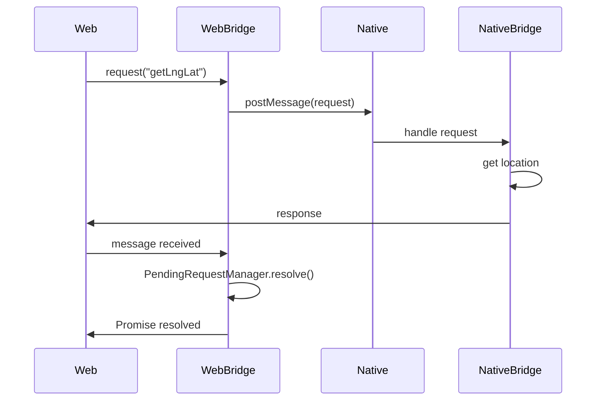
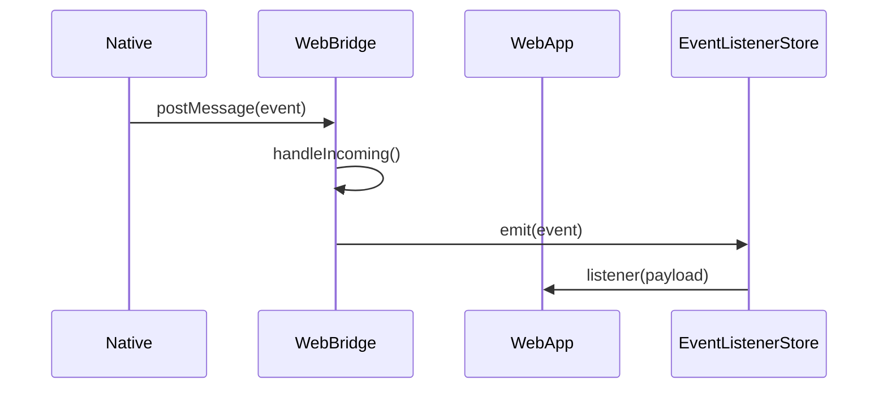

# @knockdog/bridge-web

`@knockdog/bridge-web`은 Knockdog 브릿지 시스템의 **웹(Web) 런타임 패키지**입니다.

이 패키지는 다음 역할을 담당합니다.

* Web → Native 메시지 전송
* Native → Web 메시지 수신
* request/response lifecycle 관리
* Native 이벤트를 Web에서 구독

이 패키지는 다음과 함께 사용됩니다.

* `@knockdog/bridge-core`
  브릿지 프로토콜, 타입, 에러 정의
* `@knockdog/bridge-native`
  Native 측 브릿지 구현

---

# 개요

`bridge-web`은 다음과 같은 구조로 설계되어 있습니다.

* `WebBridge` → 브릿지의 **public facade**
* `managers` → 내부 상태 관리
* `transport` → 메시지 송수신
* `utils` → 메시지 파싱 / 최소 검증
* `api` → 앱에서 사용하기 쉬운 wrapper API

---

# 폴더 구조

```txt
src/
  api/
    bridgeApi.ts

  bridge/
    WebBridge.ts
    types.ts

  env/
    getReactNativeWebView.ts

  managers/
    EventListenerStore.ts
    PendingRequestManager.ts

  transport/
    WindowMessageReceiver.ts
    GlobalBridgeAdapter.ts
    postToNative.ts

  utils/
    isBridgeMessage.ts
    parseBridgeMessage.ts

  globals.d.ts
  index.ts
```

---

# 각 모듈 역할

## bridge/

브릿지의 핵심 public API가 위치합니다.

### WebBridge.ts

브릿지의 메인 클래스입니다.

다음 기능을 제공합니다.

* `request()` RPC 호출
* `emit()` Native 이벤트 전송
* `on()` Native 이벤트 구독
* `destroy()` 브릿지 정리

또한 내부적으로 다음 컴포넌트를 조합합니다.

* PendingRequestManager
* EventListenerStore
* WindowMessageReceiver
* GlobalBridgeAdapter

---

### types.ts

WebBridge에서 사용하는 public 타입을 정의합니다.

예:

* `WebBridgeOptions`
* `Listener`
* `Unsubscribe`

---

# api/

브릿지 RPC를 **앱에서 사용하기 쉬운 형태로 감싸는 레이어**입니다.

예:

```ts
bridge.request("getLngLat", {})
```

대신

```ts
bridgeApi.getLngLat()
```

처럼 사용할 수 있습니다.

### 예시

```ts
import { WebBridge } from "../bridge/WebBridge";

export class BridgeApi {
  constructor(private bridge: WebBridge) {}

  getLngLat() {
    return this.bridge.request("getLngLat", {});
  }

  openCamera() {
    return this.bridge.request("openCamera", {});
  }

  login(provider: "kakao" | "google") {
    return this.bridge.request("login", { provider });
  }
}
```

사용 예:

```ts
const bridge = new WebBridge();
const bridgeApi = new BridgeApi(bridge);

const location = await bridgeApi.getLngLat();
```

---

# managers/

브릿지 내부 상태를 관리합니다.

## EventListenerStore

Native에서 오는 이벤트를 관리합니다.

기능

* 이벤트 구독
* 이벤트 해제
* 이벤트 dispatch

---

## PendingRequestManager

request/response 매칭을 관리합니다.

기능

* pending request 저장
* response 도착 시 resolve
* timeout 처리
* destroy 시 rejectAll

---

# transport/

메시지 송수신을 담당하는 레이어입니다.

## WindowMessageReceiver

다음 채널을 통해 메시지를 수신합니다.

```ts
window.addEventListener("message")
```

Native → Web 메시지를 처리합니다.

---

## GlobalBridgeAdapter

다음 방식으로 Native가 직접 메시지를 전달할 수 있습니다.

```ts
window.__bridge.receive(...)
```

Native에서 `injectJavaScript`로 호출할 때 사용됩니다.

---

## postToNative

다음 API를 통해 Native로 메시지를 전송합니다.

```ts
window.ReactNativeWebView.postMessage()
```

---

# env/

환경 접근을 캡슐화합니다.

## getReactNativeWebView

```ts
window.ReactNativeWebView
```

에 안전하게 접근하기 위한 helper입니다.

---

# utils/

브릿지 메시지 처리 관련 유틸리티입니다.

## parseBridgeMessage

* JSON 파싱
* 메시지 형식 확인

---

## isBridgeMessage

브릿지 메시지인지 최소한의 shape 검증을 수행합니다.

transport layer에서는 **최소 검증만 수행**합니다.

---

# globals.d.ts

다음 전역 객체 타입을 확장합니다.

```ts
window.ReactNativeWebView
window.__bridge
window.__bridgeDebug
```

또한 `export {}` 를 사용하여 파일을 **TypeScript module로 처리**하도록 합니다.

---

# 설치

```bash
pnpm add @knockdog/bridge-web
```

이 패키지는 `@knockdog/bridge-core`에 의존합니다.

---

# 기본 사용법

## 1️⃣ 브릿지 생성

```ts
import { WebBridge } from "@knockdog/bridge-web";

const bridge = new WebBridge({
  timeoutMs: 8000,
  debug: true,
});
```

---

## 2️⃣ RPC 호출

```ts
const location = await bridge.request("getLngLat", {});
```

---

## 3️⃣ Native 이벤트 전송

```ts
bridge.emit("toast", {
  message: "Hello from Web",
});
```

---

## 4️⃣ Native 이벤트 구독

```ts
const off = bridge.on("authChanged", (payload) => {
  console.log(payload);
});
```

구독 해제

```ts
off();
```

---

## 5️⃣ 브릿지 정리

```ts
bridge.destroy();
```

destroy 시

* 모든 pending request reject
* 모든 event listener 제거
* receiver detach

---

# 메시지 흐름

## Web → Native

```
bridge.request()
   ↓
postToNative()
   ↓
Native 처리
   ↓
Native response
   ↓
WindowMessageReceiver / GlobalBridgeAdapter
   ↓
WebBridge.handleIncoming()
   ↓
PendingRequestManager.resolve()
```

---

## Native → Web 이벤트

```
Native event
   ↓
WindowMessageReceiver / GlobalBridgeAdapter
   ↓
WebBridge.handleIncoming()
   ↓
EventListenerStore.emit()
   ↓
Web listener 실행
```

---

# 에러 처리

브릿지 에러는 `BridgeException`을 사용합니다.

주요 에러 코드

| 코드         | 설명                   |
| ---------- | -------------------- |
| ENOTFOUND  | Native 브릿지 없음        |
| ETIMEDOUT  | request timeout      |
| EDESTROYED | bridge destroy 이후 호출 |
| EUNKNOWN   | 예상하지 못한 에러           |

---

# 설계 원칙

## 1️⃣ Transport는 최대한 단순하게 유지

transport layer의 역할

* 메시지 수신
* 최소 shape 검증
* dispatch

복잡한 validation은 수행하지 않습니다.

---

## 2️⃣ 프로토콜 정의는 bridge-core에서 관리

다음은 `bridge-core`에서 정의합니다.

* BridgeMessage
* RPCMethod
* error shape
* version

---

## 3️⃣ WebBridge는 generic runtime으로 유지

다음과 같은 앱 기능은 WebBridge에 직접 추가하지 않습니다.

예

* getLngLat
* openCamera
* share
* login

이러한 API는 `api/` 레이어에 구현합니다.

---

## 4️⃣ 작은 컴포넌트 조합 구조

WebBridge는 다음 컴포넌트를 조합합니다.

* PendingRequestManager
* EventListenerStore
* WindowMessageReceiver
* GlobalBridgeAdapter

이를 통해

* 가독성
* 테스트 용이성
* 유지보수성

을 확보합니다.

---

# 권장 사용 패턴

```ts
import { WebBridge } from "@knockdog/bridge-web";
import { BridgeApi } from "./api/bridgeApi";

export const bridge = new WebBridge({
  debug: process.env.NODE_ENV !== "production",
});

export const bridgeApi = new BridgeApi(bridge);
```

사용

```ts
const location = await bridgeApi.getLngLat();
```

---

# 향후 확장 가능 기능

* handshake / ready 상태
* request interceptor
* debug logger
* metrics hook
* retry 정책
* strict runtime validation

---

# 정리

`@knockdog/bridge-web`은

* Web ↔ Native 통신을 위한 브릿지 런타임
* transport / state / api 계층 분리
* 확장 가능한 구조

를 목표로 설계되었습니다.

---

원하면 내가 추가로 **README에 넣으면 좋은 것 3가지**도 알려줄게.

1️⃣ 브릿지 메시지 예시 (JSON)
2️⃣ Native ↔ Web sequence diagram
3️⃣ 브릿지 lifecycle 다이어그램

이 세 개 추가하면 **오픈소스 수준 README**가 된다.


---

# 브릿지 메시지 예시

브릿지는 JSON 메시지를 기반으로 통신합니다.

모든 메시지는 공통적으로 다음 메타 정보를 포함합니다.

```json
{
  "id": "abc123",
  "meta": {
    "v": 1,
    "source": "web",
    "ts": 1700000000000
  }
}
```

---

## Web → Native Request

웹에서 Native 기능을 호출할 때 사용합니다.

```json
{
  "id": "req_123",
  "type": "request",
  "method": "getLngLat",
  "params": {},
  "meta": {
    "v": 1,
    "source": "web",
    "ts": 1700000000000
  }
}
```

---

## Native → Web Response (성공)

```json
{
  "id": "req_123",
  "type": "response",
  "ok": true,
  "result": {
    "lat": 37.5665,
    "lng": 126.9780
  },
  "meta": {
    "v": 1,
    "source": "native",
    "ts": 1700000000500
  }
}
```

---

## Native → Web Response (에러)

```json
{
  "id": "req_123",
  "type": "response",
  "ok": false,
  "error": {
    "code": "PERMISSION_DENIED",
    "message": "Location permission denied"
  },
  "meta": {
    "v": 1,
    "source": "native",
    "ts": 1700000000500
  }
}
```

---

## Native → Web Event

Native에서 Web으로 이벤트를 보낼 때 사용합니다.

```json
{
  "id": "evt_123",
  "type": "event",
  "event": "authChanged",
  "payload": {
    "userId": "1234"
  },
  "meta": {
    "v": 1,
    "source": "native",
    "ts": 1700000000100
  }
}
```

---

# Web ↔ Native 시퀀스 다이어그램

### Web → Native RPC 호출



---

### Native → Web 이벤트 전달



---

# Bridge Lifecycle

브릿지는 다음과 같은 lifecycle을 가집니다.

```mermaid
flowchart TD

A[WebBridge 생성] --> B[Receiver attach]
B --> C[Native 메시지 수신]
C --> D{메시지 타입}

D -->|request| E[Native 처리]
D -->|response| F[PendingRequest resolve]
D -->|event| G[EventListener emit]

F --> H[Promise resolve]
G --> I[Web Listener 실행]

A --> J[emit / request 사용]

J --> C

K[destroy()] --> L[Receiver detach]
L --> M[PendingRequest rejectAll]
M --> N[EventListener clear]
```

---

# 브릿지 Lifecycle 요약

브릿지의 주요 단계

1️⃣ **생성**

```ts
const bridge = new WebBridge()
```

* receiver attach
* message listener 등록

---

2️⃣ **사용**

* `request()` RPC 호출
* `emit()` 이벤트 전송
* `on()` 이벤트 구독

---

3️⃣ **메시지 처리**

수신 메시지는 다음 순서로 처리됩니다.

```
receiver
   ↓
parseBridgeMessage
   ↓
WebBridge.handleIncoming
   ↓
PendingRequestManager / EventListenerStore
```

---

4️⃣ **destroy**

```ts
bridge.destroy()
```

동작

* receiver detach
* pending request 모두 reject
* event listener 제거

---

# 실제 앱에서 권장 구조

```ts
import { WebBridge } from "@knockdog/bridge-web"
import { BridgeApi } from "./api/bridgeApi"

export const bridge = new WebBridge({
  debug: process.env.NODE_ENV !== "production",
})

export const bridgeApi = new BridgeApi(bridge)
```

사용

```ts
const location = await bridgeApi.getLngLat()
```

---

# 정리

`@knockdog/bridge-web`은 다음 목표로 설계되었습니다.

* Web ↔ Native 통신 런타임 제공
* transport / state / api 레이어 분리
* 확장 가능한 브릿지 구조 유지
* 최소 runtime validation
* 안정적인 request/response lifecycle 관리

